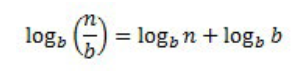
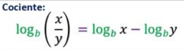

<style>
.red {
    color: red;
}

.blue {
    color: blue;
}
</style>

# <span class='blue'>Ejercicios recursividad con python</span>

## <span class='red'>Ejercicio 1</span>

 Implementar una función que permita obtener el valor en la sucesión de Fibonacci para un número dado

 ```python
 def fibonacci(n):
    if n == 0 or n == 1:
        return n
    return fibonacci(n-1) + fibonacci(n-2)

print(fibonacci(7))
 ```
 Este algoritmo es extremadamente lento, de hecho no intenten probarlo con un valor como 80 o estarán una eternidad esperando a que finalice.

 La razón de esta lentitud es la cantidad de veces que repetimos operaciones que ya hemos realizado, he encontrado un paper que
 lo explica por lo que les dejo esta bonita imagen de aca.

 

 Una forma de mejorarlo es hacerlo sin recursividad, si pensamos el problema de una forma distinta (Comenzando desde 1 e ir aumentando hasta llegar al valor ingresado en vez de comenzar desde el valor ingresado e ir disminuyendo hasta 1), podemos generar un algoritmo iterativo en el que sólo realizaremos cada cálculo 1 vez

 ```python
    
 def fibonacci2(n):
    if n == 0 or n == 1:
        return n
    a = 1
    b = 1
    for i in range(n-2): #n-2 porque los primeros 2 casos los tomamos en el if anterior
        a, b = b, a+b
    return b

 print(fibonacci2(80))
#--> 23416728348467685

 ```

## <span class='red'>Ejercicio 2 </span>
 
 Implementar una función que calcule la suma de todos los números enteros comprendidos entre cero y un número entero positivo dado.

 ```python
 '''
 Suma el primer numero y vuelve a llamarse pero restando 1, cuando n sea igual a 1 se finaliza la recursividad
 '''

 def sumatoria(n):
     if n == 0:
         return 0

     if n<0: #Para el caso en que n sea negativo
         print(n)
         return n + sumatoria(n+1)

     return n + sumatoria(n-1) 

 print(sumatoria(-10))
 ```

## <span class="red">Ejercicio 3</span>

 Implementar una función para calcular el producto de dos números enteros dados.

 ```python
 def multiplicacion(a,b):
    if b==1 or b == -1:
        return a
    #Caso en que sea negativo, multiplico por -1 y llamo a la misma función como si fuera poitiva
    if b < 0: 
        return -1*(a + multiplicacion(a, abs(b)-1))

    return a + multiplicacion(a, b-1)

 print(multiplicacion(-5, -4))
 #--> 20
 ```

## <span class="red">Ejercicio 4</span>

 Implementar una función para calcular la potencia dado dos números enteros, el primero representa la base y segundo el exponente

```python
 def potencia(a,b):
    if b==1:
        return a
    #Caso exponente negativo
    if b<0:
        return 1/(a*potencia(a, abs(b)-1))
    return a * potencia(a, b-1)

 print(potencia(-5, -4))
 #--> 0.0016
```
## <span class="red">Ejercicio 5</span>

 Desarrollar una función que permita convertir un número romano en un número decimal.

 ```python
 '''
 Esta es la primera versión, sin embargo luego de un poco de estudio he recordado este ejercicio y encontré una forma más legible para programarlo, la adjunto en la versión 2
 '''
 def romano_a_decimal(string):
    lista = list(string)
    if len(lista) == 0:
        return 0
    romano = lista.pop(0)

    if romano == 'M':
        return 1000 + romano_a_decimal(lista)
    
    elif romano == 'D':
        if len(lista) != 0 and lista[0] in 'M':
            return -500 + romano_a_decimal(lista)
        return 500 + romano_a_decimal(lista)

    elif romano == 'C':
        if len(lista) != 0 and lista[0] in 'DM':
            return -100 + romano_a_decimal(lista)
        return 100 + romano_a_decimal(lista)

    elif romano == 'L':
        if len(lista) != 0 and lista[0] in 'CDM':
            return -50 + romano_a_decimal(lista)
        return 50 + romano_a_decimal(lista)

    elif romano == 'X':
        if len(lista) != 0 and lista[0] in 'LCDM':
            return -10 + romano_a_decimal(lista)
        return 10 + romano_a_decimal(lista)

    elif romano == 'V':
        if len(lista) != 0 and lista[0] in 'XLCDM':
            return -5 + romano_a_decimal(lista)
        return 5 + romano_a_decimal(lista)

    elif romano == 'I':
        if len(lista) != 0 and lista[0] in 'VXLCDM':
            return -1 + romano_a_decimal(lista)
        return 1 + romano_a_decimal(lista)

print(romano_a_decimal('XLV'))
#--> 45
```
### <span class="red">Versión Número 2</span>

```python
def romano_a_decimal(string):
    if not string:
        return 0
    
    valores = {'M':1000, 'D':500, 'C':100, 'L':50, 'X':10, 'V':5, 'I':1}

    valor_decimal = valores[string[0]]
    
    if len(string) > 1 and valores[string[1]] > valor_decimal:
        return -valor_decimal + romano_a_decimal(string[1:])
    return valor_decimal + romano_a_decimal(string[1:])

print(romano_a_decimal('XLV'))
#--> 45
```

## <span class="red">Ejercicio 6</span>
 Dada una secuencia de caracteres, obtener dicha secuencia invertida

```python
def revertir(string):
    print(string)
    if len(string) <= 1:
        return string
    return revertir(string[1:]) + string[0]

print(revertir('mecanografía'))
#-->aífargonacem
```
## <span class="red">Ejercicio 7</span>

 Desarrollar un algoritmo que permita calcular la siguiente serie:

 

 ```python
 def serie(n):
    if n == 0:
        return 'No puedes dividir por 0'
    elif n == 1:
        return n
    return 1/n + serie(n-1)
print(serie(4))
#-->2.08333333
```


## <span class="red">Ejercicio 8</span>

### Notas de Cristian, aún no logro resolverlo D:

Implementar una función para calcular el logaritmo entero de número n en una base b. Recordar que:
Eppa, notas de Cristian, el libro aparentemente tiene un pequeño error, aparece esta imagen:


Pero buscando un poco más de información sobre las propiedades de los logaritmos me he dado cuenta de que realmente debería ser esta la fórmula:



## <span class="red">Ejercicio 9</span>

Desarrollar un algoritmo que cuente la cantidad de dígitos de un número entero.

```python
 def contar_digitos(n):
    #Antes de comprobar el caso base compruebo si es negativo ya que mi caso base interrumpirá la ejecución esperada en caso de que lo sea. 
    if n < 0:
        return 1 + contar_digitos(abs(n)/10) #Paso n a positivo
    
    if n/10<1:
        return 1
    return 1 + contar_digitos(n/10)

 print(contar_digitos(-1234886234))
 #--> 10
```
## <span class="red">Ejercicio 10</span>
 Desarrollar un algoritmo que invierta un número entero sin convertirlo a cadena.

 ```python
import math

'''

Notas de Cristian, Este estuvo un poco más complejo, les recomiendo no ver la solución en código y darle unas cuantas vueltas antes de ver la solución

'''
import math

def invertir(n=1023):
    
    if n<=1 and n>=-1:
        return n
    
    if n<0:
        return -1*(abs(n)%10 * 10 ** math.trunc(math.log10(abs(n)))) +  invertir(math.trunc(n/10))

    return n%10 * 10 ** math.trunc(math.log10(n)) +  invertir(n//10) 

print(invertir(-123456789))

#-->-987654321
```

## <span class="red">Ejercicio 11</span>

Desarrollar el algoritmo de Euclides para calcular el máximo común divisor (MCD) de dos números enteros.

 ```python
 '''
 Recomiendo buscar información sobre el algoritmo de euclides, es más fácil de lo que parece
 '''
 def MCD(num1, num2):
    if num1%num2==0:
        return num2

    if num1>num2:
        return MCD(num2, num1%num2)
    
    return MCD(num1, num2%num1)

    print(MCD(350,450))
    #-->50
 ```

## <span class="red">Ejercicio 12</span>
 Desarrollar el algoritmo de Euclides para calcular también el mínimo común múltiplo (MCM) de dos números enteros.
 
 ```python
 def MCM(num1, num2, formula):
    if num1%num2==0:
        return num2

    if num1>num2:
        if not formula:
            return (num1*num2)//MCM(num2, num1%num2, True)
        return(MCM(num2, num1%num2, True))
    if not formula:
        return (num1*num2)//MCM(num1, num2%num1, True)
    return MCM(num1, num2%num1, True)

 print(MCM(350,450, False))
 #-->3150
```

## <span class="red">Ejercicio 13</span>
 Implementar un función recursiva que permita obtener el valor de an en una sucesión geométrica (o progresión geométrica) con un valor a1=2 y una razón r=-3. Además desarrollar un algoritmo que permita visualizar todos los valores de dicha sucesión desde a1 hasta an.


 ```python
 def progresion(n):
    if n == 0:
        return 0
    print(2*(-3)**(n-1))
    return progresion(n-1)

print(progresion(8))
```